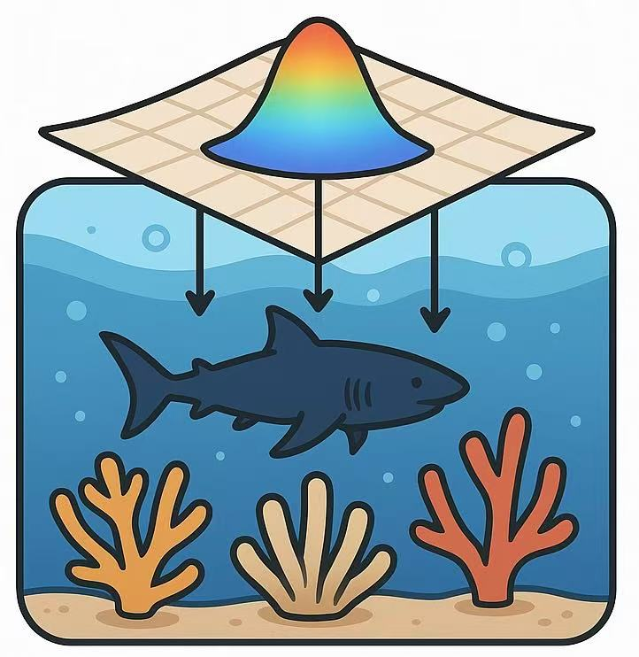
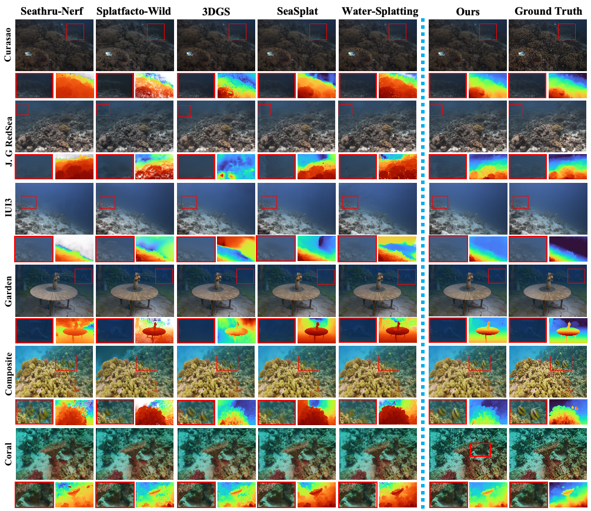
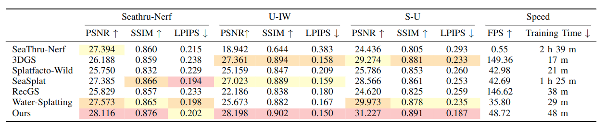

# <h2 align="center">  <a href="">3D-UIR: 3D Gaussian for Underwater 3D Scene Reconstruction via Physics-Based Appearance-Medium Decoupling</a></h2>

<h5 align="center">

This repo contains code for the paper "3D-UIR: 3D Gaussian for Underwater 3D Scene Reconstruction via Physics-Based Appearance-Medium Decoupling"

[**🌐 Homepage**](https://bilityniu.github.io/3D-UIR/) | [**📑 Paper**](https://arxiv.org/pdf/2505.21238) | [**💻 Code**](https://github.com/bilityniu/3D-UIR) | [**📖 arXiv**](https://arxiv.org/abs/2505.21238)

<p align="center">

</p>

## 📰 News
* **🔥[2025.05.27]** Paper released on arXiv! [[Paper](https://arxiv.org/abs/2505.21238)]
* **🔥[2025.06.16]** Code repository is now available! [[Code](https://github.com/bilityniu/3D-UIR)]


## ⭐ Method Overview
We propose **3D-UIR**, a physics-based underwater 3D scene reconstruction framework that addresses the unique challenges of complex light-media interactions in underwater environments. Our method disentangles object appearance from water medium effects through specialized Gaussian modeling, achieving both high-quality novel view synthesis and physically accurate scene restoration.

<p align="center">

</p>

Our approach consists of three main components:

- **Underwater Appearance Modeling (UAM)**: Incorporates appearance features and embeddings for maintaining view consistency across various perspectives.
- **Scatter Medium Modeling (SMM)**: Separately handles backscatter and attenuation effects that influence underwater object appearance.
- **Distance-guided Regularization Optimization (DRO)**: Uses pseudo-depth maps to guide parameter estimation and enhance depth accuracy.

## 📊 Experimental Results

### Qualitative Comparison
<p align="center">

</p>
Our method effectively models the scene medium to render photorealistic novel views with accurate scene representation, yielding more consistent scene rendering across novel viewpoints and effective elimination of underwater artifacts.

### Quantitative Comparison

We evaluate our method on three datasets: **SeaThru-NeRF**, **Underwater in the Wild (U-IW)**, and **our Simulated dataset (S-U)**. Our method achieves state-of-the-art performance across all metrics:

<p align="center">

</p>


## 🛠️ Installation

Please clone our repository and change to that folder
```bash
git clone https://github.com/bilityniu/3D-UIR.git
cd 3D-UIR
```

Create a new python environment and install relevant requirements
```bash
conda create -n 3d-uir python=3.10
conda activate 3d-uir
pip install torch==2.1.0 torchvision==0.16.0 torchaudio==2.1.0 --index-url https://download.pytorch.org/whl/cu118
conda install cudatoolkit-dev=11.8 -c conda-forge

pip install -r requirements.txt

pip install submodules/diff-gaussian-rasterization
pip install submodules/simple-knn/
pip install submodules/fused-ssim/

# Install tiny-cuda-nn
pip install ninja git+https://github.com/NVlabs/tiny-cuda-nn/#subdirectory=bindings/torch
```

**Note**: If you encounter issues with tiny-cuda-nn installation, you can try local installation from [tiny-cuda-nn repository](https://github.com/NVlabs/tiny-cuda-nn).

## 🔧 Training and Evaluation

### Training
To run the optimizer, simply use:

```bash
python train.py -s <path to COLMAP or NeRF Synthetic dataset>
```

### Depth Regularization

To achieve better reconstructed scenes, we use depth maps as priors during optimization. The depth regularization improves quality significantly for some scenes. Generate depth maps for each input image using:

1. Clone Depth Anything v2:
```bash
git clone https://github.com/DepthAnything/Depth-Anything-V2.git
```

2. Download weights from [Depth-Anything-V2-Large](https://huggingface.co/depth-anything/Depth-Anything-V2-Large/resolve/main/depth_anything_v2_vitl.pth?download=true) and place it under `Depth-Anything-V2/checkpoints/`

3. Generate depth maps:
```bash
python Depth-Anything-V2/run.py --encoder vitl --pred-only --grayscale --img-path <path to input images> --outdir <output path>
```

4. Generate depth parameters:
```bash
python utils/make_depth_scale.py --base_dir <path to colmap> --depths_dir <path to generated depths>
```

5. Train with depth regularization:
```bash
python train.py -s <path to COLMAP or NeRF Synthetic dataset> -d <path to depth maps>
```

### Evaluation and Rendering

```bash
# Train with train/test split
python train.py -s <path to COLMAP or NeRF Synthetic dataset> --eval

# Generate renderings
python render.py -m <path to trained model>

# Compute error metrics on renderings
python metrics.py -m <path to trained model>

# Generate video renderings
python render_video.py -m <path to trained model>
```

**Note**: This project is built upon [3D GS](https://github.com/graphdeco-inria/gaussian-splatting). For more details and advanced usage, please refer to the original repository.

## 📷 Interactive Viewer

The Pre-built Viewer for Windows can be found [here](https://drive.google.com/file/d/1DRFrtFUfz27QvQKOWbYXbRS2o2eSgaUT/view). If you use Ubuntu or want to check the viewer usage, please refer to [GS Monitor](https://github.com/RongLiu-Leo/Gaussian-Splatting-Monitor).

**Launch the Viewer**

After extracting or installing the viewers, you may run the compiled `SIBR_gaussianViewer_app[_config]` app in `<SIBR install dir>/bin`, e.g.:

```bash
# Ubuntu/Linux
./SIBR_viewers/install/bin/SIBR_remoteGaussian_app
```

On Windows system:
```bash
<path to downloaded/compiled viewer>/bin/SIBR_remoteGaussian_app_rwdi.exe
```


## 📂 Dataset

### Dataset Format

Our COLMAP loaders expect the following dataset structure in the source path location:

```
<location>
|---images
|   |---<image 0>
|   |---<image 1>
|   |---...
|---depths
|   |---<depth 0>
|   |---<depth 1>
|   |---...
|---sparse
    |---0
        |---cameras.bin
        |---images.bin
        |---points3D.bin
        |---depth_params.json
```

## 📖 Citation

If you find our repo useful for your research, please cite:

```bibtex
@misc{yuan2025_3duir,
  title={3D-UIR: 3D Gaussian for Underwater 3D Scene Reconstruction via Physics Based Appearance-Medium Decoupling}, 
  author={Jieyu Yuan and Yujun Li and Yuanlin Zhang and Chunle Guo and Xiongxin Tang and Ruixing Wang and Chongyi Li},
  year={2025},
  eprint={2505.21238},
  archivePrefix={arXiv},
  primaryClass={cs.CV},
  url={https://arxiv.org/abs/2505.21238}
}
```

## 📮 Contact

Feel free to contact us at **jieyuyuan.cn[AT]gmail.com** for any questions or collaborations!


## 📜 License

This project is licensed under the Pi-Lab License 1.0 - see the [LICENSE](https://bilityniu.github.io/3D-UIR/blob/main/LICENSE) file for details.

## 🤝 Acknowledgments

Our repo is developed based on [3DGS](https://github.com/graphdeco-inria/gaussian-splatting), [GS Monitor](https://github.com/RongLiu-Leo/Gaussian-Splatting-Monitor?tab=readme-ov-file) and [DeepSeeColor](https://github.com/warplab/DeepSeeColor?tab=readme-ov-file). We thank all the authors for their great repos.
